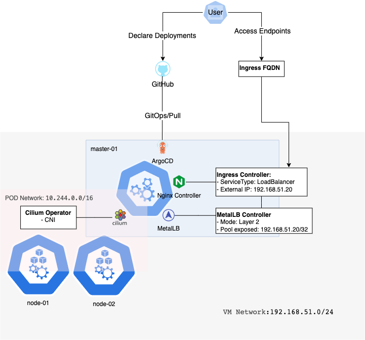

# local-cluster

## Overview

The goal of this project is to provide a simulation of a production cluster in a local workstation. Based on SRE principles, it provides an introduction to the following concepts:

- Declarative Infrastructure
  - IAC
- Service Orchestrator
  - mServices approach
  - Declarative Management
  - Availability and Scalability
- Hermetic Builds/GitOps
  - SSOT
  - Deployment strategies
  - Reusable pipelines
- Observability
  - Monitoring
  - Alerting
  - Reporting and SLIs/SLOs

There are plenty of impressive and quick solutions to spin up a new local cluster and test a workload. In this implementation, I wanted to split the layers within a topology, as close as possible to a production environment, from Infra to Service. Also, it is a project for fun, learn, gain experience, and describe my workstation as a code.

## Topology

### Monorepo Structure

```shell
├── gitops              #Directory for argo cd applications
│   ├── infrastructure
│   │   └──             #argo applications for infra deployments
│   ├── observability
│   │   └──             #argo applications for observability deployments
│   └── products
│       └──             #argo applications for product deployments
├── iac                 #Directory for IAC manifests
│   ├── cloud           #Declarative infra at Cloud
│   │   ├── configuration
│   │   └── provision
│   └── local           #Imperative infra at local workstation
│       ├── configuration #Configure with Ansible
│       └── provision   #Provision with Vagrant and Virtualbox
├── meta-charts         #Meta helm charts, used by Argo GitOps applications
│   └── 
└── scripts             #Path for scripts
```

### Infrastructure

#### local



#### Workflow

```yaml
Local Workstation ->
# Spin up infra
                  Vagrant ->
                  # Spawn VMs
                  # Configure VMs with Ansible
                            VMs -> 
                            # Spin up Kubernetes
                                Ansible -> 
                                  # Setup Cluster
                                          Kubernetes: Kubeadm
                                          CRI: Containerd
                                          CNI: Cilium
                                          LB: MetalLB
                                          Ingress: NGINX
                                          GitOps: ArgoCD

```

## Getting Started

### Tooling

This project requires the following softwares:

- [VirtualBox](https://www.virtualbox.org)
- [Vagrant](https://www.vagrantup.com)
- [Ansible](https://www.ansible.com)
- [kubectl](https://kubernetes.io/docs/tasks/tools/)

### Quick install for OSX

```shell
brew install virtualbox vagrant ansible kubectl
```

## Usage

### Get available commands

```shell
make help
```

```shell
destroy-local-cluster          : Destroy local cluster
reload-local-cluster           : Upgrade the configuration. If you want to parse Ansible args, as in start-local-cluster
restart-local-cluster          : Restart local cluster
start-local-cluster            : Start local cluster. If you want to parse Ansible args, call it with ARG var. e.g. make start-local-cluster ARGS='--skip-tags="gitOps"'
status-local-cluster           : Get the status of local cluster
suspend-local-cluster          : Suspend status of local cluster
```

### Configuration

The main configuration for the local cluster is the [Vagrantfile](./iac/local/provision/vagrantfile).

```ruby
#Cluster
CLUSTER = {
  "master" => { :count => 1, :cpus => 2, :mem => 2048, :groups => "masters" },
  "worker" => { :count => 2, :cpus => 5, :mem => 2048, :groups => "workers" }
}

#OS
IMAGE_NAME = "bento/ubuntu"
IMAGE_TAG = "22.04"
IMAGE = IMAGE_NAME + "-" + IMAGE_TAG

#Network
SUBNET="192.168.51."
DOMAIN_NAME="cluster.localnet"
METALLB="192.168.51.20"

#Kubernetes
KUBERNETES_VERSION="1.24.0"
```

### Create cluster

```shell
 make start-local-cluster
```

This will :

- Create 3 VMs
- Provision Kubernetes Cluster with kubeadm (1 Master,2 Workers)
- Deploy:
  - CRI: Containerd
  - CNI: Cilium
  - Ingress Controller: Nginx
  - LB: MetalLB
  - GitOps Operator: ArgoCD

Then ArgoCD, will sync the applications described at [gitops](./gitops/) directory, and will deploy them.


If you don't want to install ArgoCD and the applications at [gitops](./gitops/), you can parse Ansible args to skip the gitOps tag.
Actually, you can parse any Ansible flag you want.

```shell
make start-local-cluster ARGS='--skip-tags="gitOps"'
```

If everything goes according to the plan, you will have:

- A K8S Cluster
- LB accessible from local workstation
- Process will take up to 20m aprox.

### Local kubeconfig

In order to protect your kubeconfig file, this action has to be done manually.
After cluster provision, a new file created `/tmp/local-user-kubeconfig`, and
it contains the kubeconfig from our cluster.

Simply run `make local-kubeconf`

```shell
➜ make local-kubeconf

Property "users.local-user" unset.
Property "clusters.local-cluster" unset.
Property "contexts.local-user@local-cluster" unset.
Kubeconfig updated...
Switched to context "local-user@local-cluster".
```

Or run manually the steps to backup your kubeconfig and merge the new one:

```shell
kubectl config unset users.local-user || true && \
kubectl config unset clusters.local-cluster || true && \
kubectl config unset contexts.local-user@local-cluster|| true && \
cp $HOME/.kube/config $HOME/.kube/config.backup.$(date +%Y-%m-%d.%H:%M:%S) && \
KUBECONFIG=$HOME/.kube/config:/tmp/local-user-kubeconfig kubectl config view --merge --flatten > $HOME/.kube/merged_kubeconfig && mv $HOME/.kube/merged_kubeconfig $HOME/.kube/config && echo "Kubeconfig updated..." && kubectl config use-context local-user@local-cluster
```

Get the contexts:

```shell
kubectl config get-contexts
```

```shell
CURRENT   NAME                             CLUSTER           AUTHINFO                                      NAMESPACE
*         local-user@local-cluster         local-cluster     local-user
```

Interact with the cluster to get the deployed ingresses:

```shell
kubectl get ing --all-namespaces

NAMESPACE               NAME                                 CLASS   HOSTS                           ADDRESS         PORTS     AGE
argo-cd                 argo-cd-argocd-server                nginx   argocd.cluster.localnet         192.168.51.20   80        3h44m
harbor                  harbor-ingress                       nginx   harbor.cluster.localnet         192.168.51.20   80, 443   5m46s
kube-prometheus-stack   kube-prometheus-stack-alertmanager   nginx   alertmanager.cluster.localnet   192.168.51.20   80        3h41m
kube-prometheus-stack   kube-prometheus-stack-grafana        nginx   grafana.cluster.localnet        192.168.51.20   80        3h41m
kube-prometheus-stack   kube-prometheus-stack-prometheus     nginx   prometheus.cluster.localnet     192.168.51.20   80        3h41m
```

### Local Domain Resolver

Act as a local DNS resolver for the domain `cluster.localnet`. Every new host of this domain, will be automatically resolved from the workstation, to the defined LB IP form MetalLB.

Install dnsmasq

```shell
brew install dnsmasq
```

Create the record for new zone

```shell
cat <<EOF | sudo tee -a /usr/local/etc/dnsmasq.conf
address=/.cluster.localnet/192.168.51.20
port=53
EOF
```

Create a local DNS resolver for the new zone

```shell
cat <<EOF | sudo tee /etc/resolver/cluster.localnet
domain cluster.localnet
search cluster.localnet
nameserver 127.0.0.1
EOF
```

Start service as root

```shell
sudo brew services restart dnsmasq
```
